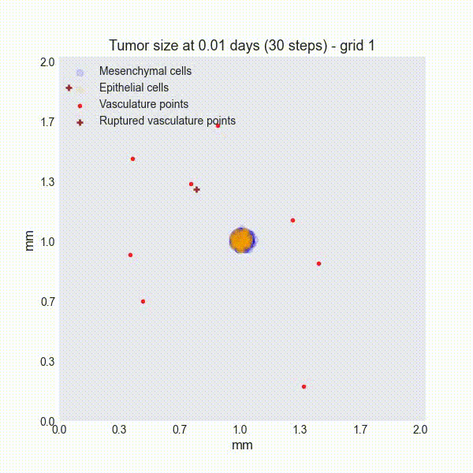

# MetaSpread: a cancer and metastasis simulation package

MetaSpread is a cancer and metastasis simulator written in Python, based on the work of Franssen et al [[1]](#1) and the MESA framework [[2]](#2). With this package it is possible to simulate how cancer cells reproduce and diffuse locally, and generate metastases by spreading to other parts of the body.

The underlying model is a reaction-diffusion type model with deterministic and stochastic aspects, tracking the spatiotemporal evolution of: i) numbers of epithelial and mesenchymal cancer cells (modelled as discrete agents); and ii) the densities of the extracellular matrix and the diffusible matrix metalloproteinase-2 (MMP-2), in both the primary site and all secondary sites. Other processes represented in the simulator are the circulation of cancer cell clusters and single cancer cells in the vasculature, including cell death and disaggregation of clusters, and the extravasation of clusters and single cells to distant metastatic sites.

# Requirements

Python 3.10. Support for future releases of python is not guaranteed.

Packages:
- matplotlib 3.8.0
- Mesa 2.1.2
- numpy 1.26.0
- pandas 2.1.1
- pynput 1.7.6
- opencv_python 4.8.1.78

# Installing the package

MetaSpread is available as an official PyPi package. To install, simply run:

```console
pip install metaspread
```

If you want to install manually, you can also download the source code as a zip file, unzip in an appropiate directory, and run

```console
python -m metaspread
```
# Quickstart

MetaSpread has an interactive mode and a CLI API. For a quick showcase of the package's capabilities, run the following commands:

## 1. Set up working directory
```console
mkdir tutorial-cli && cd tutorial-cli
```

## 2. Run a simulation (e.g., 300 steps, saving every 30 steps)
```console
python -m metaspread run 300 30
```

## 3. Postprocess result (generate data, plots, and videos)  
*Generates 10 images per plot over time and a video at 1 frame per second:*
```console
python -m metaspread postprocess all Sim-max_steps-300-collection_period-30-cells-388-grids_number-3 10 1
```

## 4. Visualize the results
Go to the `Videos` inside the `Sim-max_steps-300-collection_period-30-cells-388-grids_number-3` directory and check the results. You should get the following:



# Documentation

For further details on how to use the program please refer to the [Documentation.](https://metaspread.readthedocs.io/en/stable/)


# Contributing

Everyone is welcome to contribute! To check more details about how to help the project, please go to [Contributing](https://github.com/alfredohernandezinostroza/MetaSpread/blob/main/CONTRIBUTING.md).

# Testing

In order to run the unit tests, you will have to install both `pytest` and `pytest-mock`:
```console
pip install pytest pytest-mock
```

Then, clone the repository and run:

```console
pytest
```

# References

><a id="1">[1]</a>  Franssen, L. C., Lorenzi, T., Burgess, A. E., & Chaplain, M. A. (2019). A mathematical framework for modelling the metastatic spread of cancer. Bulletin of Mathematical Biology, 81, 1965–2010.

><a id="2">[2]</a>  Masad, D., & Kazil, J. (2015). MESA: An agent-based modeling framework. 14th PYTHON in Science Conference, 2015, 53–60.

><a id="3">[3]</a>  Hernández-Inostroza, A. and Gjini, E., MetaSpread: A cancer growth and metastatic spread simulation program in Python, 2024 (submitted).


