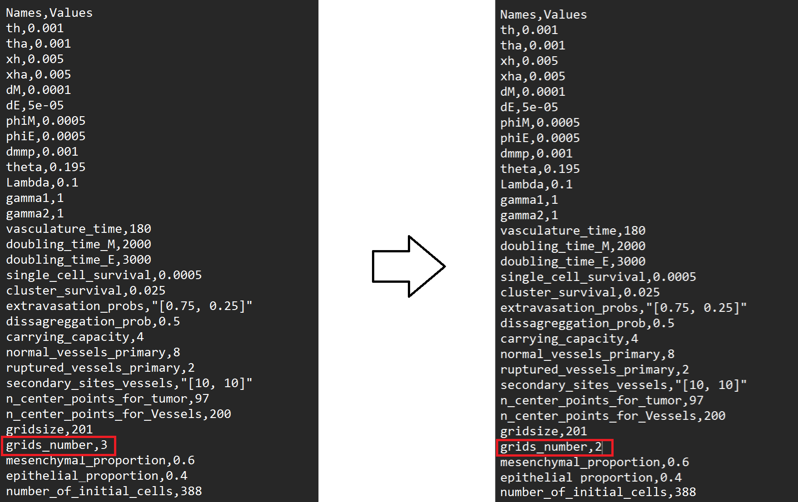

Tutorial: running a simulation in interactive mode
=====

.. :contents::
    :depth: 1

This tutorial will guide you through the basic usage of MetaSpread through the interactive mode, from running a simulation to visualizing the results.

Installation
------------
If you haven't installed MetaSpread yet, use the following command:

.. code-block:: console
   
   pip install metaspread

or:

.. code-block:: console

   python -m pip install metaspread

Running metaspread
------------------

Once installed, create a folder for this tutorial project. For example, this command will create a folder called "tutorial-interactive":
.. code-block:: console

   mkdir tutorial-interactive

Then, navigate to this folder:
.. code-block:: console

   cd tutorial-interactive

Use the following command on a terminal to run MetaSpread in interactive mode:

.. code-block:: console

   python -m metaspread

Since this is the first time you run MetaSpread, it will create a file called ``simulation_configs.csv``. This file contains the default parameters for the simulation, which you can modify later.

Afterwards, the interactive interface will be launched, displaying the main menu.:

.. image:: main_menu.png

The main menu provides several options for running simulations and visualizing results. To select an option, move with the up and down arrow keys. To select an option, press enter.

First, we will focus on running a new simulation. 

Running a Simulation
--------------------

1. **Editing the parameters**: the default parameters are already set in the ``simulation_configs.csv`` file. You can edit this file to change the parameters of your simulation. To edit the file, you can use any text editor or spreadsheet software that supports CSV format. For this tutorial, we will change the default cell number to 400, the number of grids to 2. For simplicity, we will use a text editor. The file should look like this:

   In principle, in order to change the amount of initial cells, and the number of grids, it is only necessary to change the values in the ``cells`` and ``grids_number`` rows, respectively. 

   However, this will give an error when running the simulation:

   This is because there are certain parameters that depend on the number of grids, such as the ``extravasation_probs`` and ``secondary_sites_vessels``. Thus, it is necessary to change these parameters as well. The ``extravasation_probs`` parameter should be a list of probabilities for each secondary grid, and the ``secondary_sites_vessels`` parameter should be a list of the number of vessels in each secondary grid.Both of these parameters should have a length equal to the number of grids - 1. Thus, we can change the parameters accordingly:
   

2. **Start a simulation**: select the ``New Simulation`` option from the main menu.
3. **Introduce the total time steps for the simulation**: you will be prompted to enter the total number of time steps for the simulation. For this tutorial, we will use 1000 time steps.

4. **Introduce the interval for saving the results**: you will be prompted to enter the interval for saving the results. This is the number of time steps between each saved result. For this tutorial, we will use an interval of 50 time steps.

.. image:: select_save_interval.png

This will start the simulation, you will see the progress of the simulation in the terminal. The simulation will run for the specified number of time steps, saving the results at the specified interval:
.. image:: simulation_progress.png
A directory called ``Simulations`` will be created in the current directory, containing a subfolder with the name of the simulation. Inside this folder, you will find the results of the simulation.

5. **Simulation completed**: once the simulation is completed, you will see a message indicating that the simulation has finished. You should see a folder named ``Sim-max_steps-1000-collection_period-50-cells-400-grids_number-2`` inside the simulators directory.

Inside the details of the simulation including mmp2 and ecm concentrations, cell locations, and vasculature data will be saved in CSV files, in their respective folders. These files can be opened with any spreadsheet software or analyzed using Python or R, or with MetaSpread's built-in data analysis tools.
